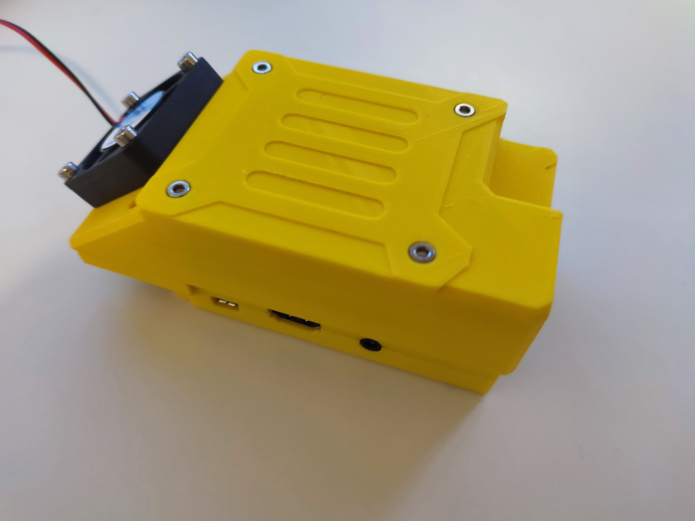

# Irrigation-Pi Casings
3D models for Irrigation-Pi casing that you can print yourself.

## Casings
### Movray
This nice casing was contributed by [@movray](https://github.com/movray).
See it's [documentation](movray/README.md) for versions and printing options.



## Fan and Fan Control
If you want to add a fan to your case, I recommend using a PWM capable fan and the
[PWM Fan Control software from John Parks](https://github.com/folkhack/raspberry-pi-pwm-fan-2). 

For a Raspberry Pi 3 these are good 
[settings for adjusting to the CPU temperature](https://github.com/folkhack/raspberry-pi-pwm-fan-2?tab=readme-ov-file#environment-varibale-reference):
* PWM_FAN_MIN_OFF_TEMP_C=55
* PWM_FAN_MIN_ON_TEMP_C=60
* PWM_FAN_MAX_TEMP_C=70

## Testing Fan Control
Produce stress on the Raspberry Pi:
```shell
stress-ng --cpu 0
```
Watch the CPU temperature in another terminal:
```shell
watch -n 1 vcgencmd measure_temp
```